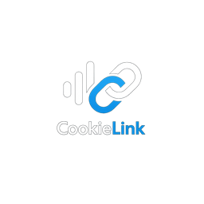
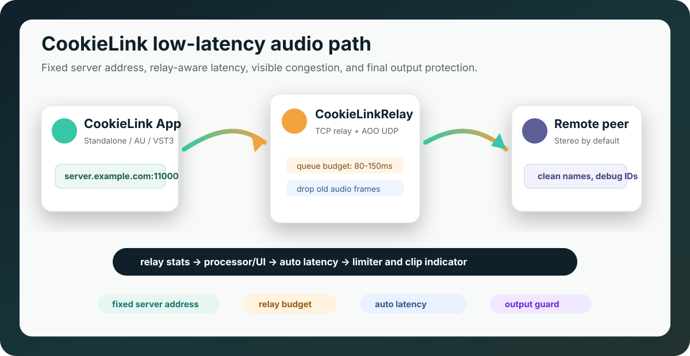
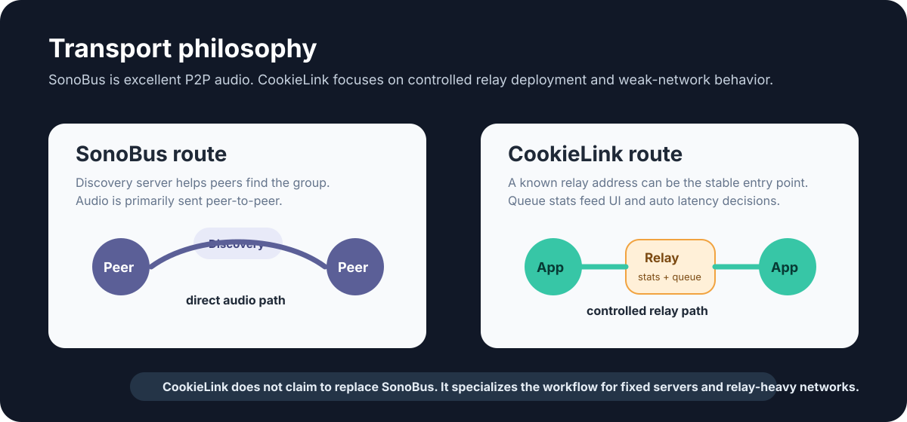
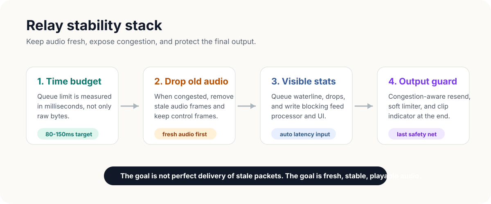

# CookieLink

<p align="center">
  
</p>

<h1 align="center">CookieLink</h1>

<p align="center">
  面向远程排练、直播连线、播客协作和小团队音频互联的低延迟网络音频工具。
</p>

<p align="center">
  <a href="#快速开始"></a>
  <a href="#与-sonobus-的区别"></a>
  <a href="#稳定性设计"></a>
  <a href="LICENSE"></a>
</p>

<p align="center">
  
</p>

## 一句话

CookieLink 保留 SonoBus/AOO/JUCE 这类低延迟网络音频工程的核心优势，同时把产品重心放在 **可控服务器地址、TCP Relay 稳定性、自动延迟可观测、最后一道爆音保护** 上。

如果你需要的是一个开箱即用、成熟、多平台、偏 P2P 的音乐协作工具，优先看 [SonoBus](https://github.com/sonosaurus/sonobus)。如果你的使用场景经常遇到 NAT、校园网、公司网、跨地区弱网、直播间固定服务器或“必须让用户填一个服务器地址就能连”的需求，CookieLink 更贴近这个方向。

## 核心特性

| 能力 | CookieLink 的做法 | 对使用者的意义 |
| --- | --- | --- |
| 服务器地址 | 设置里直接填写服务器地址，不做内置服务器列表 | 部署、测试、私有化更直接 |
| Relay 模式 | 独立 `CookieLinkRelay` 仓库和 TCP relay 服务 | 直连不稳定时仍有清晰兜底路径 |
| 自动延迟 | Relay 队列水位、丢帧数、写阻塞耗时参与判断 | 弱网时不只看本地音频缓冲 |
| 队列保护 | Relay 队列按时间预算控制，超出丢旧音频帧，保留控制帧 | 避免旧音频堆积成越来越大的延迟 |
| 音质策略 | 默认立体声；拥塞时不自动降码率/声道 | 不偷偷降低音质，交给用户明确选择 |
| 爆音保护 | master output soft limiter + clip 指示 | 最后一道保护，避免瞬时峰值刺耳 |
| 调试显示 | 默认隐藏用户名后面的 `@数字`，调试模式才显示 | 正常使用界面更干净 |
| macOS 权限 | Standalone 构建后自动 codesign 并带麦克风权限 entitlements | 减少 Apple Silicon 上反复弹权限的问题 |

## 与 SonoBus 的区别

[SonoBus](https://github.com/sonosaurus/sonobus) 的官方 README 描述了它的定位：高质量、低延迟、多用户、P2P 音频；连接服务器主要用于让同组用户互相发现，音频数据直接在用户之间传输。CookieLink 参考了这个工程路线，但目标不是做一个“换皮 SonoBus”，而是把弱网和 Relay 场景做得更可控。

<p align="center">
  
</p>

| 维度 | SonoBus | CookieLink |
| --- | --- | --- |
| 主要传输模型 | 组名/密码发现后，用户之间直接 P2P 传音频 | 支持 AOO/P2P 思路，同时强化 TCP Relay 路径 |
| 服务器角色 | 连接服务器偏发现/协调 | Relay 服务器可以承载音频转发，是部署核心的一部分 |
| UI 入口 | 面向组会话、混音、录制、音质调节 | 面向固定服务器地址、快速连接、少干扰显示 |
| 弱网策略 | 用户可看网络统计并调延迟/质量 | Relay 指标进入 processor/UI 和自动延迟判断 |
| 拥塞处理 | 可独立调整不同用户的音质/码率 | 不自动降低音质；优先控制 resend、队列和 buffer |
| 爆音兜底 | 依赖用户设置和音频链路控制 | 额外加入 master soft limiter 与 clip 指示 |
| 部署形态 | App/插件与连接服务器生态 | `CookieLink` 和 `CookieLinkRelay` 拆成两个仓库 |

### CookieLink 更适合

- 你要给用户一个固定服务器地址，让他们填入后直接连接。
- 你控制自己的 Relay 节点，需要知道队列水位、丢帧、写阻塞。
- 你的场景更怕“越卡越延迟”，而不是短暂丢弃旧音频帧。
- 你不希望程序在拥塞时自动降低码率或声道。
- 你需要给非技术用户隐藏调试 ID，只在排查时打开。

### SonoBus 仍然更适合

- 你要完整、成熟、跨平台的通用 P2P 音乐协作产品。
- 你需要 SonoBus 已有的移动端、录音、声卡/插件生态和社区文档。
- 你的网络环境直连质量好，不需要自建 Relay 作为主路径。

## 稳定性设计

<p align="center">
  
</p>

CookieLink 的 Relay 优化集中在三个层面：

1. **不让队列无限变老**
   Relay 队列上限用时间预算表达，例如 80-150ms。超过预算时丢弃旧音频帧，保留控制帧，让连接状态和控制消息先活下来。

2. **让自动延迟看到真实拥塞**
   relay queue waterline、dropped frames、write block time 会暴露到 processor/UI，并参与自动延迟判断。这样自动延迟不再只靠本地 buffer 感觉网络。

3. **防止坏网络越补越堵**
   TCP relay 下的 AOO resend 具备拥塞感知。网络差时不会盲目重发导致队列更长，而是让 buffer 和 resend 更稳地配合。

最后，master output soft limiter 和 clip 指示作为音频输出前的最后保护层，帮助用户及时发现峰值和爆音风险。

## 快速开始

### 构建 App

```sh
cmake -S . -B build -DCMAKE_BUILD_TYPE=Debug -DCOOKIELINK_MACOS_CODESIGN_IDENTITY=CookieSign
cmake --build build --target CookieLink_Standalone -j2
```

生成位置：

```text
build/CookieLink_artefacts/Debug/Standalone/CookieLink.app
```

如果没有本地签名证书，可以把签名参数改成 ad-hoc：

```sh
cmake -S . -B build -DCMAKE_BUILD_TYPE=Debug -DCOOKIELINK_MACOS_CODESIGN_IDENTITY=-
```

### 构建插件

JUCE 会按平台生成可用格式。常见目标包括：

```text
CookieLink_VST3
CookieLink_AU
CookieLink_LV2
```

AAX 需要本机或 CI 提供 AAX SDK：

```sh
cmake -S . -B build -DCMAKE_BUILD_TYPE=Release -DAAX_SDK_PATH=/path/to/AAX_SDK
cmake --build build --target CookieLink_All --config Release -j2
```

生成 AAX 后必须签名，否则 Pro Tools 无法正常加载。打包脚本会在发现 AAX 产物时执行：

```sh
codesign --force --verify --verbose --sign "CookieSign" --options runtime --timestamp "CookieLink.aaxplugin"
wraptool sign --verbose --account "$PACE_ACCOUNT" --password "$PACE_PASSWORD" --wcguid "$PACE_WCGUID" --signid "$PACE_SIGNID" --in "CookieLink.aaxplugin" --out "signed-aax/CookieLink.aaxplugin"
```

## 发布二进制

GitHub Actions 已提供手动发布流程：

1. 打开仓库的 **Actions** 页面。
2. 选择 **Build and Release CookieLink**。
3. 点击 **Run workflow**，输入 tag，例如 `v1.0.0`。

流程会构建并发布：

- `CookieLink-<tag>-macos-universal.pkg`
  - 安装 `CookieLink.app`
  - 安装 `CookieLink.vst3`
  - 安装 `CookieLink.component`
  - 安装 `CookieLink.lv2`
  - 如果打开 `include_aax` 且签名环境完整，会安装已签名的 `CookieLink.aaxplugin` 或 `Cookie Link.aaxplugin`
- `CookieLink-<tag>-linux-x64.deb`
  - 安装 `cookielink`
  - 安装 `CookieLink.vst3`
  - 安装 `CookieLink.lv2`
- `CookieLink-<tag>-windows-x64-installer.exe`
  - 安装 `CookieLink.exe`
  - 安装 `CookieLink.vst3`

### AAX 发布配置

AAX SDK、PACE 工具和签名证书不能放进公开仓库。需要 AAX 时，建议使用配置好的 self-hosted macOS runner，或在 GitHub 仓库配置以下私有变量/Secrets：

| 名称 | 类型 | 用途 |
| --- | --- | --- |
| `AAX_SDK_PATH` | Repository variable | self-hosted runner 上的 AAX SDK 路径 |
| `PACE_WRAPTOOL_PATH` | Repository variable | self-hosted runner 上的 `wraptool` 路径 |
| `MACOS_CODESIGN_IDENTITY` | Repository variable | 默认可用 `CookieSign` |
| `PACE_ACCOUNT` | Secret | PACE 账号 |
| `PACE_PASSWORD` | Secret | PACE 密码 |
| `PACE_WCGUID` | Secret | PACE wraptool `--wcguid` |
| `PACE_SIGNID` | Secret | PACE wraptool `--signid` |
| `MACOS_CERTIFICATE_P12_BASE64` | Secret | 如果 runner 没有安装证书，可放 `CookieSign.p12` 的 base64 |
| `MACOS_CERTIFICATE_PASSWORD` | Secret | `.p12` 密码 |
| `MACOS_KEYCHAIN_PASSWORD` | Secret | CI 临时 keychain 密码 |

签名机还必须有可用的 PACE Eden Tools 许可证（iLok2、iLok3 或 iLok Cloud）。没有这个许可证时，`wraptool sign` 会失败，脚本会停止发布，避免生成 Pro Tools 不能加载的 AAX。

本地打包可以直接使用同一套脚本：

```sh
cmake -S . -B build -DCMAKE_BUILD_TYPE=Release -DCOOKIELINK_MACOS_CODESIGN_IDENTITY=CookieSign
cmake --build build --target CookieLink_All --config Release -j2
./packaging/macos_package.sh v1.0.0 build dist
```

## 仓库拆分

这个仓库只放主 App/插件：

```text
CookieLink/
  Source/
  images/
  deps/juce/
  deps/aoo/
  deps/ff_meters/
  deps/mac/
  deps/windows/
```

Relay 服务器独立放到：

```text
CookieLinkRelay/
  server/TcpRelayServer.cpp
  Source/RelayProtocol.h
  deps/juce/
  deps/aoo/
```

这样上传 GitHub 时，App 和 Relay 可以分别建仓库、分别发 release、分别写部署文档。

## 已排除的内容

导出仓库时有意排除了这些内容：

| 排除项 | 原因 |
| --- | --- |
| `build/`, `build-codex/`, `dist/` | 本地构建和打包产物 |
| `aax-sdk-2-9-0/` | 大型第三方 SDK，不应随仓库上传 |
| `server/aooserver-master/` | 旧服务器工程，当前 Relay 不依赖 |
| `desktop-shell-ui/` | UI 源工程不是当前构建必需项 |
| `eydata-demo/` | 授权接口演示工程，和开源主仓无关 |
| `docs/beta/`, `omx_wiki/` | 本地发布/工作记忆，不适合公开仓库 |
| JUCE examples/docs | 对当前构建不是必须，减小仓库体积 |
| AOO docs/Pd examples | 对当前构建不是必须，减小仓库体积 |

## 开源与致谢

CookieLink 使用 JUCE、AOO、Opus、ff_meters 等组件，并参考 SonoBus 的低延迟网络音频产品经验。请保留各依赖目录中的许可证文件。

CookieLink 不是 SonoBus 官方版本，也不代表 SonoBus 项目。SonoBus 原项目请访问：

- GitHub: <https://github.com/sonosaurus/sonobus>
- Website: <https://sonobus.net>

## License

本项目按 `LICENSE` 和 `LICENSE_EXCEPTION` 中的条款发布。第三方依赖按各自许可证发布。
